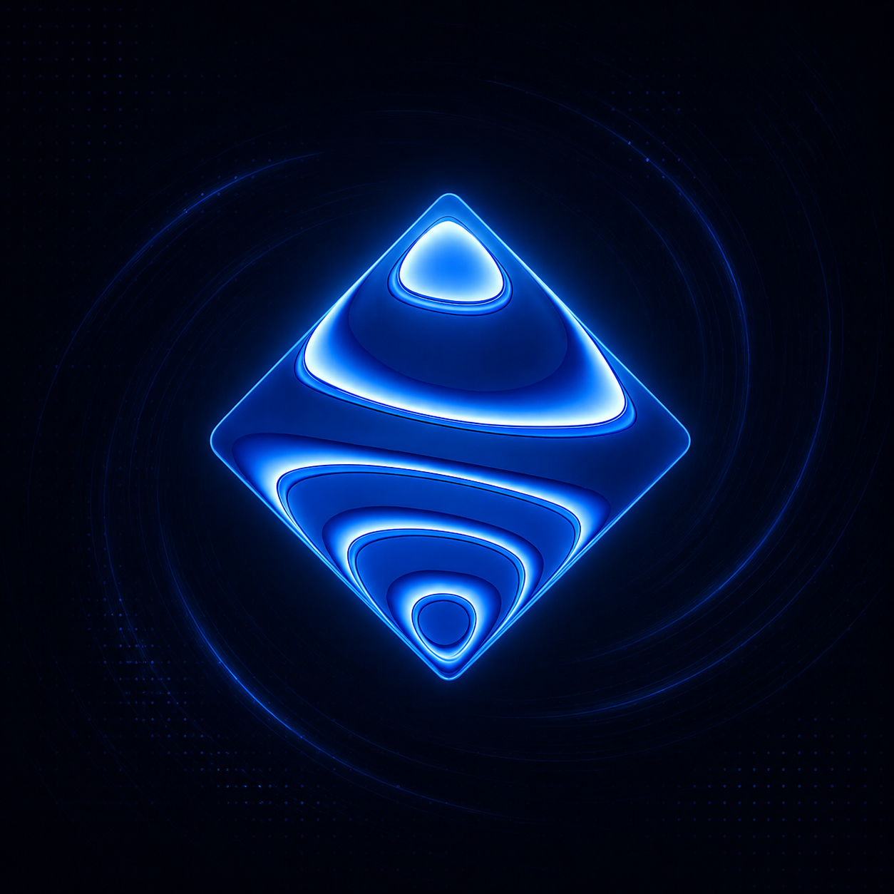

<center><a href="https://virta.lol"></a></center>

# Virta

<a href="https://www.electronjs.org"></a>

### Every stream. One current.

Virta is a cross-platform open-source streaming command center. It pulls together the chat from
every platform you broadcast to into a single real-time feed with moderation, cross-posting,
filtering, live analytics, highlights detection, and a plugin marketplace built on top. It stays
fast and legible under heavy load, and new platforms slot in without changes to the core.

One engine powers every interface: a desktop app, a terminal client, the browser, and a built-in
OBS overlay, with your channels, filters, profiles, and themes in sync across all of them. Run it
on your own machine by default, or host it on a server or in the cloud and reach it from
anywhere.

## Features

- **Unified, platform-tagged feed:** every chat in one strictly time-ordered stream, each
  message marked by its origin
- **Read anonymously, send when you sign in:** full read access with no account; auth is opt-in
  and per platform
- **Cross-posting:** one message to several platforms at once, rate-governed, with partial-send
  awareness (unreachable targets shown *before* you hit enter, never failed after)
- **Unified moderation:** timeouts/bans/deletes, slash commands, and an AutoMod/held-message
  queue, across platforms, from one pane
- **Filtering:** highlight, hide, and profanity-mask by platform/channel/author/keyword, plus a
  **calm mode** that keeps high-velocity chat readable without dropping a message
- **Full emotes:** native emotes plus 7TV, BTTV, and FFZ (animated, cached, live-updating)
- **Dockable workspace:** VSCode-style dockable panels, multi-window pop-outs, a command palette,
  and full keyboard navigation
- **Live stats:** concurrent viewers *per platform and combined*, messages/sec, unique chatters,
  emote leaderboards
- **Embedded stream tiles:** watch your own broadcast next to chat via each platform's player
- **Profiles:** saved workspaces (channels, layout, filters, theme, accounts) you switch between
  from a list; your last session is always restored when you open the app
- **Highlights timeline:** scrollable history of hype moments, spikes, and keyword hits from the
  session
- **Plugin marketplace:** install and manage plugins; VOD replay included out of the box
- **Local-first & private:** ephemeral by default, optional logging with instant search, SQLite
  or Postgres, secrets in your OS keychain
- **Every surface:** desktop app, terminal UI, web, and a zero-install OBS overlay, all from one
  engine
- **Extensible:** a public local API with scoped tokens, signed outbound webhooks, and shareable
  theme packs

## Table of contents

- [Why Virta](#why-virta)
- [Currently supported platforms](#currently-supported-platforms)
- [What it does](#what-it-does)
- [Surfaces](#surfaces)
- [Your data, your machine](#your-data-your-machine)
- [Extend it](#extend-it)
- [On the roadmap](#on-the-roadmap)
- [Cross-platform](#cross-platform)
- [Build & run](#build--run)
- [License](#license)

## Why Virta

Creators who stream to more than one place currently juggle several browser tabs (or pay a
subscription) just to see their own chat. Moderators working communities that span platforms
have no single pane and no fast, reliable cross-platform tooling. Viewers who follow a creator
everywhere want one window, not several.

- **Unified, not bolted-on.** Every platform normalizes into one message model, so filters,
  profiles, emote resolution, stats, and moderation are written once and apply everywhere.
- **Local-first, deploy anywhere.** The engine runs on your own machine by default, with no
  third-party service in the loop. The same design lets you host it on a server or in a container
  instead and reach it from any interface.
- **Built for performance.** The feed stays smooth and legible at high message rates; rendering
  and message processing are engineered to keep heavy work off the hot path.
- **Scales with you.** From a single channel to many across platforms, and from the built-in
  SQLite store to Postgres when you need it.
- **Transparent.** When a source degrades, the interface shows a clear, labeled state, never a
  quietly empty feed.
- **Extensible by design.** Adding a platform is a self-contained adapter; the engine, pipeline,
  storage, and interfaces stay untouched.

## Currently supported platforms

Virta is platform-agnostic at its core; these are the platforms shipping today, each declared
with the access it honestly provides.

| Platform | Read | Send & moderate | Notes |
|---|---|---|---|
| **Twitch** | anonymous or signed in | signed in | full chat, emotes, badges, events, replies |
| **Kick** | anonymous or signed in | signed in | official API for send & moderation |
| **YouTube** | anonymous or signed in | read-only | live chat via innertube; send and moderation not yet supported |
| **X** (live broadcasts) | best-effort | experimental | no official chat API exists anywhere; runs in your own browser session, clearly labeled, and isolated so its breakage never affects the others |

Each platform reports its real-time capabilities, so the UI only offers actions a platform (and
your sign-in state) actually supports. More platforms are planned; the adapter model makes them
community-contributable without engine changes.

## What it does

**The feed**
- Unified, strictly time-ordered feed with an origin mark on every row
- Per-channel panes alongside the unified feed
- Emotes: native plus 7TV / BTTV / FFZ (animated, disk-cached, live updates)
- Badges and contrast-clamped name colors; sub / raid / gift / follow event rows
- Replies and threading (quoted context, click-to-jump) where supported
- First-time-chatter highlighting
- Pause-on-hover with scrollback and an "N new messages" resume pill

**Filtering & focus**
- Keyword/mention **highlights** with desktop notifications
- **Hide** by type, author, keyword, or platform
- **Profanity / content filter:** masks matched terms with click-to-reveal, from per-language
  lists plus your own; applied before TTS and outbound integrations
- **Calm mode** for high-velocity chat: combo-collapse ("KEKW ×41"), emote-only collapse, smart
  sampling with a "+37 messages" expander, and priority lanes (mentions, mods, subs, first-timers
  are never sampled away). Shapes display only; logging and stats still see everything.

**Sending & moderation**
- Authenticated send with a send-target picker
- **Cross-posting:** one message to several targets at once, rate-governed, with **partial-send
  awareness** that shows unreachable targets dimmed and excludes them *before* the send rather
  than failing it
- **Slash commands** (`/ban`, `/timeout`, `/me`, `/slow`, …) routed to typed actions:
  capability-checked, rate-governed; unknown commands are hinted, never sent
- **Unified mod actions** from the feed (timeout/ban/delete) plus quick chat-settings toggles
  (slow mode, followers-only, emote-only)
- **AutoMod / held-message queue** with approve/deny; held messages never hit the feed until
  approved
- Transparent send queue: paced sends show a countdown and are never silently dropped

**Workspace**
- A VSCode-style dockable workspace: drag, resize, split, tab, and pop out any panel; saved per
  profile; collapses responsively down to mobile
- Command palette and full keyboard navigation; multi-window pop-outs (always-on-top)
- Embedded **stream preview tiles:** watch your broadcast next to chat via the platform's
  official player, with a live/offline + viewer badge (no video is ingested)
- **Live stats:** concurrent viewers per platform *and* a combined total, messages/sec, unique
  chatters, emote leaderboard, hype meter, and moment detection; works without logging
- **Highlights timeline:** scrollable panel of notable moments, hype spikes, and keyword hits
  from the session
- Mention inbox, user hovercards and pinned user cards (cross-platform identity, session context,
  quick actions, notes)
- Quick replies / canned messages; emote and @mention autocomplete

## Surfaces

Each surface is a full client of the same engine, with no feature locked to one of them:

- **Desktop** app with a native shell (tray, global hotkeys, multi-window)
- **Terminal UI** (SSH-able)
- **Web** app
- **OBS overlay** served directly by the engine: zero-install, profile-themed

## Your data, your machine

- **Ephemeral by default:** chat is never written to disk unless you turn on logging
- Optional logging with instant full-text search and retention control
- **SQLite** by default, switchable to **Postgres**; export or delete your data anytime
- Secrets live in your **OS keychain** (encrypted file-vault fallback), never in the database
- **No telemetry** without explicit opt-in

## Extend it

- A public, versioned local API (the same one the apps use) with scoped tokens
- Outbound, HMAC-signed webhooks (e.g. raid triggers lights) with retries and a delivery log
- Theme packs with a live-preview editor and shareable theme files
- **Plugin marketplace:** install and manage plugins from the built-in marketplace; supports
  remote GUI panels and local archive installs; includes VOD replay out of the box

## On the roadmap

- Live translation (offline detection + tiered engines)
- Per-viewer audience stats (opt-in): top fans, visit counts, favorite emotes
- An intelligence layer: search, semantic recall over your logs, and an MCP server
- Team/collaboration mode for co-streams and mod teams: coordination only, never pooled
  credentials
- Same-person linking across platforms, accessibility passes, and more platforms

## Cross-platform

Windows, macOS, and Linux are equal targets; OS-specific capabilities ship with declared
fallbacks.

## Install

Pre-built installers will be on [virta.lol](https://virta.lol) once the first release is tagged.
Until then, build from source.

## Build & run

Requires **Go 1.26+**.

```sh
make ci      # build + lint + test (race + coverage) + cross-compile; must be green
make run     # run the engine daemon (virtad)
make app     # produce the one-click desktop app for the current OS
```

The daemon binds to loopback on an ephemeral port and writes a discovery file with a bearer
token, so a frontend on the same machine finds and authenticates to it with no configuration.

## License

[AGPL-3.0](LICENSE).
